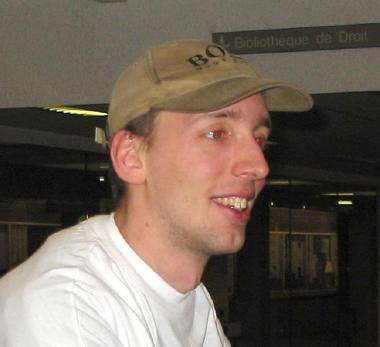

**Philippe**: Hello Raphael, you've organised the OSDEM last year and the FOSDEM this year. How did you get this idea at the beginning ?

**Raphael**: It is a long story but I'll try to make it short. In fact, this because I wanted to bring something to Free Software and I don't think I have the programming level to develop a succesful software, which would be a big contribution to the community. So I have decided to launch an event here in Brussels. At the beginning, I thought the event would have two speakers. Last year, we organised it the week-end after the Paris Linux Expo hoping that we would make Paris's speakers come to Brussels. We wanted to take advantage of the fact that they were present in Paris.

**Philippe**: Last year, you started in december for february ?

**Raphael**: Yes exactly. We have organised everything in two month and half. And we had the support of the company that was still named VA Linux at this time. This gave an unexpected scale to the event. At the end, we had more speakers coming from New York than from Paris. It was a great success, we were happy. This year, we have benefitted from the experience to reorganise the event. It is now called the FOSDEM. The F for Free Software, because last year, the big majority of the software presented were under GPL. Richard Stallman asked it and we found that it was a justified demand. It was really reflecting the spirit of the event: Free and Open Source. We have both of them represented and in the name, we have both represented in the event.

**Philippe**: Do you believe there is software here that is Open Source but not Free Software ?

**Raphael**: The past year, we had a presentation of Php. If I recall correctly, at this time, it was not Free but only Open Source. We didn't want to restrict ourself to Free Software.

**Philippe**: Usually, when I ask people, "Do you know Open Source software that is not Free", they don't know any. And when we look at the Open Source definition, what Eric Raymond says is "Open source is a marketing program for Free Software". And I think it was a great success in that sense because everybody uses the word Open Source to talk about Free Software.

**Raphael**: I believe there is a slight difference though. If both exist, there must be a reason, at least in the approach.

**Philippe**: But there are licenses recognised as Free although they are not compatible with the GPL. Everybody says Open Source is completly different, but often it refers to the same reality.

**Philippe**: How long did it take this year to organise all this ?

**Raphael**: The very first actions were taken in August. The first thing was to compile the results of the poll of the last year, just like we are doing this year, to know the feelings of the visitors. It had been sleeping during 5 or 6 month in my attic. But basically, we can say that we have organised this in 3 or 4 months.

**Philippe**: How many people are there in the organisation team ?

**Raphael**: It is much bigger than last year. We have a central team of 4 persons that organise and coordinate the whole. Then we have a team for the logistics and the info stand. We have printed 20 T-shirts for the organisation people and none are left. This makes at least 25 people organising, but there is more than that because people have been volunteering to help in addition on the saturday morning. The event here is not a professional organisation. If people want to help, they do. We had once to move some O'Reilly books. We asked visitors to help and they did. Everybody is welcome to give a hand. I am sure that there are certainly 50 persons that did help.

**Philippe**: Last year you were only 5, no ? And you were doing almost everything.

**Raphael**: Yeah, the organisation was almost me and some volunteers.

**Philippe**: How many people came last year and this year ?

**Raphael**: Last year we had ... I think around 1200 people. This year, I haven't counted, I didn't have the courage. At the opening session there was 500 or 600 people, in the big amphitheatre Janson.

**Philippe**: But it was early in the morning (10 AM), not everybody had arrived yet.

**Raphael**: I was told that on saturday, the two biggest auditoires were both filled at the same time. One is 550 and the other 450. Add to that many people discussing in the developer-rooms or in the doorway, and it's more than 1000 people. people yesterday. This morning, we had, well, I don't know

**Philippe**: Have you had a financial support ? Last year, you said you had VA Linux. And this year ?

**Raphael**: O'Reilly was our financial sponsor. And we also had other sponsors that are named in the folder, which were bringing more support for logistics and equipment: one printed the poster, one gave the PCs, one gave the switches. So one financial sponsor, O'Reilly, and other sponsors for equipment.

**Philippe**: Globally, everything is going well ?

**Raphael**: Yes, everything is going well. All the sponsors accept the non commercial nature of the event.

**Philippe**: Do you have any advices to give to someone who would want to organise something similar ?

**Raphael**: Well, what I would say is that you have to focus on the things that are important, and see if you can and look at the details later. What is important in the organisation of something like that is to move forward, to take the decisions, not spend 50 minutes to decide if yes or no, we are going to have an info stand. That's the advice.

**Philippe**: What do you keep from the event. Have you learnt something ?

**Raphael**: Well, people are really happy. A few came and congratulated me for the event. This is really pleasant. One thing really important is that we have received a good deal of financial donation. This means that people are supporting the event. They are not just visitors, they really want it to happen again the next year. We are suprised by the amount of donations we get, positively surprised.

**Philippe**: So, next year, new ideas ?

**Raphael**: For the next year, we already have ideas for the program. The developer meetings apparently have gone well. From certain groups, I had positive feedback, so we want this again next year. Perhaps better organised because there were some communication problems sometimes. We are going to keep the concept of the presentations. And we will keep it cool, no stress. If problems arise, we try to fix them. We absolutely want to keep the Fosdem spirit, which is that we are here to have fun. That's what is the most important in the event. People come to have fun, and so do we.

**Philippe**: I saw you have organised something around a deputee that wants to propose a law on computers at home. You started something before. Have you had any results during the event ?

**Raphael**: I don't want to get into details. We launched a petition. Some interest was expressed on the FOSDEM mailing list. And we had a collection of signature which is really important at the Info stand. I can't say how many because I haven't had a look at it but I saw a small pile of sheets. So yes, we can say that the petition is a success.

**Philippe**: The deputee was here at the opening session. Have you had time to discuss with her. Do you know what she thought about all that ?

**Raphael**: We have taken advantage of the FOSDEM to show to the political world an enthusiasm in the field of Free Software because we were thinking that people are not always aware that behind the free software, you have passionated people who invest themselves in what they do. **Philippe**: And especially there are ideological and political reasons to do it, this is not "just for fun".

**Raphael**: I think politicians never had or barely had any direct contact with developers from the community. Here, it was the opportunity to do it, because most of the visitors are developers, or at least technical people from the community. Well, the result of the meeting was positive. It has certainly brought its contribution.

**Philippe**: She will certainly seek some more information about Free Software.

**Raphael**: Yes, there were some really interesting dicussions. **Philippe**: I think it is really important that polticians are aware of the existence of Free Software. This is what mattered to me at least.

**Raphael**: Certainly. I think information technology is becoming more and more important in our life, and Free Software means transparency for that. With proprietary software, we don't know how it works, we don't know what data is transmitted, this is a problem for privacy.

**Philippe**: I am done with my questions. Anything to add ?

**Raphael**: I want to sleep!

**Raphael**: What I hope for you is that it allowed to make things move forward for KDE, in one way or another. It has strenghened the links between developers ?

**Philippe**: Yes. For us, it was really fantastic to be able to meet, because we almost never met. And I discussed with some Gnome people who are really nice, so it has really brought us something. It was fantastic last year already, it was fantastic this year, we will be there next year without any doubt.

**Raphael**: We wanted to organise discussion between KDE Gnome and GnuStep. Unfortunateely, it was lost on the way.

**Philippe**: Well, usually people are really focused on what they are doing. We try to get interests in connecting projects, but it is really hard to be following a concurrent project. We try to work on our own projects, and that is already a big job.

**Raphael**: I wanted to have a discussion with the public on why ... Raphel Bauduin

**Raphael** Bauduin and Phil doing weird things

**Philippe**: This would have gone into a giant troll

**Raphael**: This is why we haven't insisted on it.

**Raphael**: I really want to thank all the people who have made donations to the FOSDEM. Last year, we didn't take the opportunity to put this system in place and we were really asking ourself if the people were just passive visitors or if they were visitors and supporters of the FOSDEM, wanting to bring something. This year, we realised they are really here to bring something. The FOSDEM seems to mean something to them and they want it to be there the next year. The fact that we received many donations encourages us to continue.

**Philippe**: We thank you for everything you did for the organisation and we will meet next year.

**Raphael**: Yeah, before leaving, please insist on the first point. I am a clown, I love doing the clown, singing the Free Software Song, etc, so people see me in the front of the scene, but there is a whole team behind the FOSDEM, and without them, it would have been a failure. So I am the clown and there is all the team here to support the event.

**Philippe**: Yes of course, we thank them too. And the sponsor did also help. We thank everybody.

 jp

