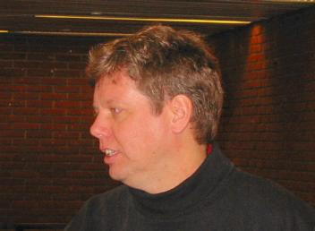

During the FOSDEM, the Free Software Award was given to Guido van
Rossum, the Python author. We had the chance to make an interview with
him.

**Bluebird**: So you are Guido van Rossum, the Python author

**Guido:** Nice to meet you.

**Bluebird**: You just received the Free Software Foundation award, no,
the Free Software award. Are you proud of that, what are your feelings ?

**Guido:** Well, I think it is a recognition of Python and my work for
keeping Python Open Source and Free Software. I have to admit I don't
always agree with Richard Stallman on every details of his politics. His
emphasis on a particular side of ethics is something I have a problem
with. So, my preferred terminlogy is Open Source. I am sorry it is not
the Open Source award. But for most practical purposes Open Source and
Free Software are the same thing. And certainly the Open Source movement
and the Free Software movement are largely overlapping, their goals are
largely the same. We agree on general ideas, like fighting monopolies of
companies like Microsoft and fighting the issue on software patents
which is currently really coming out. Those goals are what we have to
work on next. I think that's why the Open Source movement and the Free
Software movement will continue to work together despite differences
about whether it is Linux or GNU/Linux, and whether Free Software is a
better word than Open Source because in the end, that's all
uninteresting details. It is like the preacher in one village is
preaching against the preacher in the next village up as if he were the
devil.

**Bluebird**: That's not important issues, the goal is what matters.

**Guido:** What we are sharing is much more important than what is
different.

**Bluebird**: You had some issues in the past with the licensing of
Python with Richard ?

**Guido:** We resolved that in the following way : we changed the Python
license once we released a new version with the PSF, the Python Software
Foundation. We realised we could change the license. There was only one
change required to make Richard Stallman and his lawyer happy. So we
decided to do that. Now they are very happy and we are happy.

**Bluebird**: So you were just happy to meet him, there was no relief.

**Guido:** I've met him before, since then.

**Bluebird**: I read something on the Python .NET. Do you have some
opinion about this ? I read that ActiveState had developed something but
that it was really too slow to work.

**Guido:** I don't know very much about that but it's clear that we will
have to learn more about .NET . I am sorry that today, I am going to
miss Miguel de Icaza's talk about .NET and Mono because I will be on my
train back home already. But I talked to Miguel about it before. You're
right that the .NET Python version was not initiated by ActiveState,
even though ActiveState is actually releasing it. It was done by people
who did it before they worked for Active State: Mark Hammond and Greg
Stein. Later, Mark Hammond was hired by Active State but he was since
layed off because ActiveState had some financial troubles. Greg Stein
has never been more than sort of a consultant for certain occasions, he
hasn't done something for Active State. Anyway, they did a Python port
to .NET very early on, with some funding from Microsoft. I think the
issue was mostly for Microsoft to show that Common Language Runtime
really was a suitable target for multiple languages because they did the
same thing with lot of language groups. I know that the Eiffel people
got support for the Eiffel port to .NET, it's true for smaller and other
larger languages. It's true that the Python .NET interpreter is very
slow. I think part of that is just that they didn't have enough time to
make it faster, there is always optimisations. The other thing was
beacuase they did it so early on that they had to sign very strict Non
Disclosure Agreements and Mark Hammond couldn't ask anyone for help
because he was on NDA. He couldn't tell anybody even that he was working
on this project until it was finished. So if he didn't know the compiler
techniques, he was basically on his own. And there was also not much
documentation about .NET available at that point, because .NET was
basically still a Microsoft internal project. So I think now, this is
based on a few things that Miguel told me actually. There are number of
approaches to make it much faster.

**Bluebird**: Did Miguel have a look at the Python .NET port or rather
generic Python stuff ?

**Guido:** I think he had enough of a look to understand why Python is
slow and he said there are some possibilities in the byte-code that they
didn't exploit, which makes the various calls very slow. Miguel also
suggested - and that's sort of a different approach - something that I
think would work well for his .NET, Mono - to keep most of Python
running in native C and just provide stub interfaces for .NET . Python
can call .NET interfaces and other .NET programs can call Python and
when they call Python, they actually run as the native Python
interpreter. And that's what the perl folks also do. Perl .NET

**Bluebird**: I read the whitepaper on perl .NET and it seem to be a
great success. It is now a product of ActiveState

**Guido:** I am not sure but I think that doing something similar for
Python would be very useful.

**Bluebird**: What I read is that the CLR is not targeted for dynamic
typing, like Python has, which is also a problem for few other languages
they are trying to support. This was the main problem, they had to add a
runtime to do the dynamic typing, and it was very slow because of that.

**Guido:** The interesting thing is that I was at linux world in New
York a few weeks ago and there I was approached by some Microsoft people
who were interested in hearing from me about what I thought they could
change or add to the Common Language Runtime to make dynamic languages
faster.

**Bluebird**: That's very intersting.

**Guido:** That's an interesting thing that I think I want to pursue.

**Bluebird**: What I read on .NET is that the other languages had to be
changed to run/be usable in .NET because of some limitations in the
runtime. I didn't know whether Microsoft wanted to address the issue. It
seems to be moving into a positive direction.

**Guido:** There are no current efforts on the way. I think we should
try to pursue that line definitely.

**Bluebird**: You seem to be definitely "Operating System independant"
in your mind.

**Guido:** Oh absolutely. Python really runs on all systems. It runs on
everything from a Palm Pilot to a Cray!

**Bluebird**: Today we are at the Free Software and Open Source Software
development meeting. I saw you were running Windows. I guess that you
are probably the only guy in the event running windows.

**Guido:** I am not ashamed of running Windows occasionally. I only have
it on my laptop. I have a bunch of eletronic toys that come with
Software that only runs on Windows. Maybe they have a Mac version but
they certainly don't have a linux driver yet. When you buy a video
camera or something like that, it comes with a serial cable or usb
connection. There are enough reasons to be able to run windows. My
primary development system is definitely linux, my desktop is linux and
all the server machine at Zope corporation are linux.

**Bluebird**: We are here in the KDE room. Do you know that there are
Python bindings for Qt/KDE ? Have ever had a look at them ?

**Guido:**"I am pretty sure there are bindings. There are Qt bindings.
They are being actively maintained. I haven't had a look at them,
though.

**Bluebird**: Do you see any major change in the future of Python ? I
think with 2.2, now we've reached some stable state.

**Guido:** Python will always grow and change, but it's a very
evolutionary grow. We have added a whole bunch of feature to 2.2, but
we've done it in a way that it's totally backwards compatible, no old
code is broken by the new feature. What we want to do over the next few
years and the next couple of releases is to get the user communauty to
start using the new features that replace old features. So eventually we
will be able to deprecate the old features, which means that we tell you
don't use that and in the next release we actually have a warning if
you're still using it. It prints a warning that says "you should really
not be using it cause it's going to go away" and then two more releases
later or something like that, if they're using it, it's a syntax error
or a runtime error.

**Bluebird**: I think python 1.5 was working very well and still lot of
people are using it

**Guido:** Well one of the main reason that lot of people are still
stuck with python 1.5 is that's the default python that comes with
RedHat and RedHat derived systems like Mandrake. If you want to use a
newer version they now have an rpm of python2 but you have to say
"python2" to get python version 2.1 and if you say just python, you get
python 1.5. \[ Note: this is not true anymore on Mandrake 8.1 and SuSE
6.3 \]. There's also people who say python 1.5 is perfect, there's no
need for new versions. That's just crazy because there are lot of bugs
in python 1.5 that were fixed in later versions and we added major
things like unicode and garbage collection that people were clamouring
for. We added that in 2.0 and later versions. There's actually a lot of
reasons to upgrade to python 2.2.

**Bluebird**: I remember you launched something like "python for
education" or something similar ?

**Guido:** Yes, Computer programming for everybody, that was my brain
child.

**Bluebird**: Did it succeed ?

**Guido:** It did and did not succeed and i think that actually the bad
news was temporary and not very important. The good news is that people
are now taking python seriously as a teaching language in education. I
mean it started with one highschool in Arlington that had a very excited
computer science teacher: "I'm sick of java, I'm sick of c++. I'm gonna
teach my kids python." And he was very successfull. He really started
websites and his students started websites and he started posting to the
"python in education SIG". I think that there are now a lot of schools
that are doing that and also colleges that are using Python as a
teaching language for non computer-science lectures, even though the
original darpa program to get funding for python development didn't work
out.

**Bluebird**: It's now taking off

**Guido:** Using python in education's definitely taking off and there
are several books. There's one book published for beginners already, and
several more books that i know are published out soon.

**Bluebird**: That's great. I'm trying to teach python to my little
brother but..

**Guido:** How old is he ?

**Bluebird**: He is 15, but he is too much into games right now, he
doesn't want to program.

**Guido:** Yes, you need to have some motivation. You could try pygames.
I mean you can make some quite nice games in python yourself.

**Bluebird**: But it was 2 or 3 years ago when i started to try teaching
him. I was looking for something to motivate him but haven't found
anything. There was no PyGame at that time. And he can't read english,
he's french. It is quite difficult to find python resources in french.

**Guido:** Translations is not a problem. For your next python project,
get a bunch of people together, translate, and give us the result.

**Bluebird**: Yeah, I've tried to do that, but they are so many things
to do for Free Software, you can't do everything at the same time.

**Bluebird**: Have you participated in the FOSDEM ? You came especially
for the award but I don't know if you had prepared any presentation.

**Guido:** I haven't given any talk. I think, looking back, that I
should have offered to give a talk on something python-related and they
could have put it on the schedule whithout putting my name.

**Bluebird**: You could have come and said: "Hello, I'm Guido van
Rossum, I'm here for pleasure", it wouldn't have surprised anyone. We
are all coming here for fun.

**Guido:** (laughing):Somehow the organisers wanted to keep it as a big
surprise.

**Bluebird**: I think they should have made it public whithout saying
that you were coming for another special reason.

**Bluebird**: Have you met interesting people?

**Guido:** Oh definitely, yeah. Actually I had dinner with people from
FSF Europe and they told me about their political lobbying activites in
Germany and some other groups in France that are really helping
governements understand what Open Source and Free Software is and
helping them understand how they must make sure that they don't kill
these activities.

**Bluebird**: Right now in Europe, we have a big political move toward
Free Software with any major gouvernment studying if it's interesting
and some association teaching what you can have with FS, how it can be
used in administration etc. In France we have elections soon and one
candidate has already have his interest in free software.

**Guido:** Very interesting

**Bluebird**: It's really moving, this candidate invited Richard to a
talk to the national assembly. I hope we'll see something coming out of
this in few years.

**Guido:** (laughing) Richard Stallman in french national assembly!

**Bluebird**: It was a private talk. I was hoping he would talk to every
politician but it was in a room of the national assembly. But still,
it's a very big move.

**Guido:** I would be happy to do the same for the dutch govnement, if
they invite me.

**Bluebird**: You're from the Netherlands ?

**Guido:** Yes, I am dutch

**Bluebird**: I thought you were working in the USA ?

**Guido:** Seven years ago I got a job offer from the United States and
I moved there, and well, since then, I've pretty much been americanized.
I married an american woman and now we have a child together, so, we're
going to stay there, but I mean all my familly is in Holland and i also
still have a lot of friends in Holland.

**Bluebird**: Do you think you'll come back to the FOSDEM next year ?

**Guido:** Oh..If they give me another prize! The problem is that there
are so many events like this that I really have to pick and choose. I'm
away from my wife and kids for 10 days for this trip and another trip,
Tuesday and Wednesday, so I have to be careful not to accept too many
trips.

**Bluebird**: Ok, that's a problem for lot of leaders in Free Software.
Well, thank you for this great interview

**Guido:** My pleasure!
