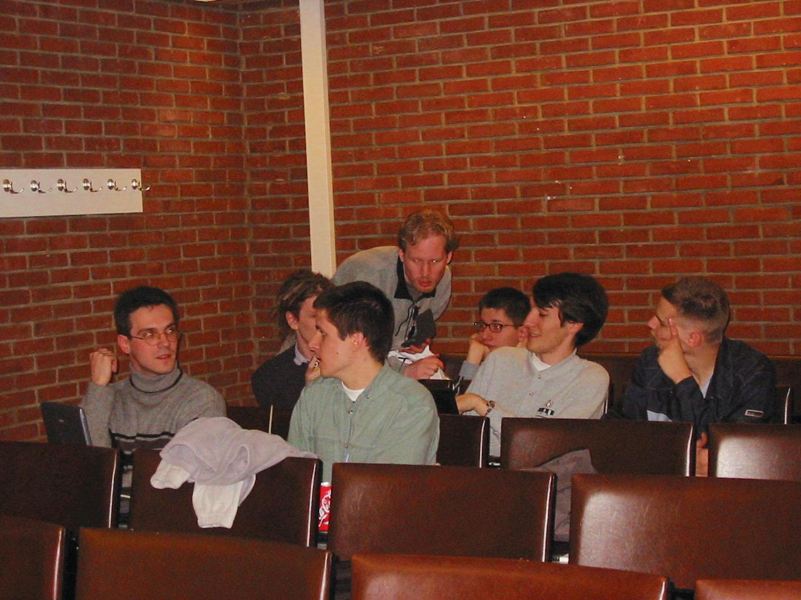

## Introduction

This interview was originally planned to take place during the FOSDEM,
but we didn't have the time to do it, so it was held on IRC on Tuesday,
February 19th 2002. Of course, the log had to be edited and reshaped.
The result is this informal interview.

The participants were:

-   Philippe: Philippe Fremy, (freehackers team), interviewer.
-   Thomas Capricelli: support, hosting, photos and help (freehackers
    team).
-   Ben: Ben Adler, logging and help
-   Werner: Werner Trobin, KOffice developer
-   David: David Faure, KOffice developer
-   Laurent: Laurent Montel, KOffice developer
-   Thomas: Thomas Zander, KOffice developer

## The Interview

**Bluebird**: How was KOffice started ?
**David**: Torben Weis originally started KOffice. He wrote the libs and
Reggie (Reginald Stadlbauer) wrote KWord and KPresenter. Torben also
wrote KSpread.
**Werner**: Torben is a programming-ueber-god. He is a
programming-task-force in himself. :-) Kalle (Matthias Kalle Dallheimer)
added KChart, which was developed for his company (Klaralvdalens
Datakonsult)

**Bluebird**: Where are they now ?
**David**: Reggie is working for Trolltech. He is behind QtDesigner.
This is why it had a "Tools" menu for inserting things, instead of
"Insert". Tools is what KWord and KPresenter had.
**Werner**: Torben is working at the Technical University of Berlin
IIRC. Last time I talked to him he was developing a CASE tool or so.
Nothing KOffice related.

**Bluebird**: How and when did you get involved in KOffice ?
**Thomas**: Ohh, I don't recall exactly when. Something like 2 or 3
years ago. I picked up where Reggie left off since he ran out of time.
KWord was unmaintained at the time.
**David**: One year ago. KWord was really needing some help, so I jumped
on the boat. I proved that it was actually possible to use the richtext
stuff in KWord, which Reggie and Thomas had started to doubt, I think.
Backporting QRichtext to Qt2 was easy. The real challenge was
redesigning KWord around it. Reggie and Thomas had great plans, but no
time for them, so I just did it.

**David**: In general I realized that I never \*ever\* started anything
new in KDE ;) I always joined in the effort started by someone else. I'm
the "manpower that makes things possible", maybe, but I never take the
initiative to break things myself. I joined Waldo for ksycoca, Coolo for
kio-make-it-cool, etc.
**Thomas**: I like working with David. I have ideas and a general design
(plans sounds good) in my head but no time to do it. David is just
someone very good at the implementation and the details and stuff; works
great together IMO :)
**David**: I agree :)

**Bluebird**: Could you give us a short report of who is doing what on
which application in KOffice right now ?
**Werner**: I am mainly hacking the core libraries and filter related
stuff.
**David**: I am implementing WYSIWYG in libkotext (common to KWord and
KPresenter), and some other KWord fixes. I really thank Mandrake for
letting me work fulltime on KDE.
**David**: Nobody is hacking KSpread right now except some random
contributors
**Laurent**: I improve KPresenter (zoom + page), add the DCOP interface
to KWord/KPresenter. I also fix some bugs in KChart.
**Thomas**: I am hacking the tables in KWord. For 2 versions they have
been rewritten twice, lets do it another time. This time I actually
think I know what I am doing. So I am implementing it the way I think it
should be done. Plus fixing the bugs that bug me in other parts of
KWord. Plus I am always bugging David about stuff he is doing in
KWord.
**Laurent**: Nobody is working on kugar and kivio.
**David**: Kontour is being redesigned by 2 or 3 people, but although
they had the time to break everything, it doesn't look like they have
time for fixing things now. :) Krayon had nobody for quite some time.
Recently someone committed a few fixes, though. All in all, it's almost
one main developer per application only, and random contributors...
surely not enough.

**Bluebird**: What about KFormula and KChart ?
**David**: KFormula has a single developer, Ulrich K�ttler with little
time. KChart has two parts. The core engine, developed by Klaralvdalens
Datakonsult (Kalle's company), and the KOffice part, on which Laurent
works sometimes.

**Bluebird**: What about the remaining ones, in the KOffice cvs: KPlato,
graphite, kosoap ?
**David**: those 3 are unreleased alpha stuff.
**Werner**: graphite is my little pet project, nothing worth writing
about in the current shape.
**David**: koshell is an old hack of mine, I'm trying to pass its
maintainance to Sven Lueppken, but it's really Werner who's hacking it
for now ;)
**Werner**: I'm really lacking time for hacking
**Thomas**: KPlato is a planning application, its been through the
design phase. The design is implemented and it is basically waiting for
people to finalize the design, I.e. fill the classes allready there.
KPlato is 'designed' by 5 people talking on a mailing list without a
line of code. I have implemented that design completely. The design I am
talking about is just the data classes, nothing more. Naturally the next
thing that has to be build after that is a GUI. But that is simply not
done.

**Bluebird**: a good project planning application is really something
missing.
**Thomas**: I know, that is why I jumped in, hoping to kickstart the
project. But after almost no code was written by others I found that
this was not worth my time for now.

**Thomas** Zander and Laurent Montel Thomas Zander/Laurent Montel at
fosdem
**Bluebird**: So basically, you are 2 full time, paid developers, plus
some filter developers, plus 3 or 4 part time contributors.
**David**: hmm, more than 3 or 4 I think, if you allow "part time" to be
very small.
**Werner**: Yes, the filter developers are Nicolas Goutte, Shaheed Haque
(lacking time), Ariya Hidayat, Clarence Dang,...
**David**: lots of filter developers, if you count them. Usually one per
filter.

**Bluebird**: It looks like some help would be welcome.
**David**: Yes, definitely. On the applications (e.g. Krayon, KPlato,
Kontour etc.) we definitely need help. Those apps have almost nobody
working on them. The other apps do need contributors, too.

**Bluebird**: What is the programming experience required to contribute
?
**David**: People usually assume that writing an office suite is very
difficult That's not true. _Some_ part of it are difficult (can I say
WYSIWYG ? ;), but there are many many missing features that are easy to
add.
**Thomas**: It is not too hard to get in. It is written in a Object
Oriented language after all. Most stuff is cleanly isolated from the
core and well documented. The hard part is getting to know the
structures of the applications, but here, we can help. After that, its
just programming, which is fun ;)
**Laurent**: Any help is welcome, whatever the experience. Some people
can create templates or write documentation, tutorials, etc... It's not
necessary to know C++. Of course, you must know C++ if you want to hack
on KWord.
**Werner**: There's also a need for GUI guys and artists. We don't have
a KoShell icon, for example, and the user interfaces are a bit crowded.

**Bluebird**: Do you have places where you would like to see someone
contributing right now ?
**David**: Definitely. Right now, KPresenter could have a UI redesign
(hiding the least used toolbar buttons etc.). KWord needs dialogs for
creating envelopes. etc. etc. Many small jobs. A new KWord developer
actually started by fixing a simple error message, and is now porting
all of KOffice-1.1.1 to KDE3....

**Bluebird**: What are the planned improvements for KOffice ?
**David**: Right now we are busy fixing the things that we broke. In
KWord, due to the WYSIWYG text layouting. In KPresenter, due to zooming
support. This sounds small, but actually, it led to a big design
change.
**Laurent**: I am fixing KChart and adding some features. Footnotes for
KWord is also planned.
**Werner**: My short term goal is to implement the rest of the new
filter system. The long term goals are e.g. a better clipboard, better
support for embedding, a general clean up of the core libraries, ... I
also plan to work on graphite a bit more if the free time allows it.

**Bluebird**: Do you have a list of features that will make it into the
upcoming release ?
**David**: Now about the long term plans... Those really depend on how
much man power we can get. We have a list for what's already done (see
the KOffice release plan, more stuff will be added to that while being
done) However, I can't say what will be in the release that is not
already done. That's where time / number of developers is the problem.
**Thomas**: My long term plans for KWord (which is all I am restricting
myself to at the moment) is adding more stuff that makes it easier to
use the application. Like markup macros. And character styles, frame
styles and page styles..
**David**: My next step for KWord is frame z-order, and then looking at
the buglist to see what people requested (for instance, double
underline...)

**Bluebird**: You planned 3 Beta and 1 Release Candidate, isn't that too
much ? KDE3 had originally 1 beta and 1 rc (which turn into a second
beta), no ?
**David**: It's exactly what we had for KOffice-1.1 . The release plan
for 1.2 is _exactly_ the same as the one for 1.1, just one year later.
Code reuse, release plan reuse ;) I think KOffice-1.1.1 is only as
stable as it is due to the multiple betas
**Werner**: KOffice gets very few testers. Some people download it and
work with it for five minutes. This simply doesn't highlight nasty bugs,
but just real showstoppers. There are only few people actually e.g.
writing a longer letter or creating a whole presentation.

**Bluebird**: So you need more users too ?
**Laurent**: yes !
**Werner**: Definitely. Most of the testing is done by us developers
**David**: Actually, betas are a really great thing for developers. We
can release code for people to test, without having to worry about it
being considered a final version, and hence a must-be-completely-stable
one. More developers is much more needed than more users. Not handled
bug reports are the proof of that. But it's true that more (advanced)
users helps finding the source of some problems. Sometimes.
**Thomas**: We have a number of end-term students (last year project in
the company) basically they all say that KOffice is not usable at the
moment, most bugs are being fixed, when that is done the
not-enough-users problem will go away.

**Laurent** Montel and David Faure hacking KPresenter during a boring
presentation Hacking during the speech
**Bluebird**: The must-ask question: what is the state of the
import/export filter for MsOffice ?
**Werner**: We have some import filters, at least. The WinWord import
filter imports tables and text/basic formatting (pictures are disabled).
The Excel import filter works quite nicely.
**David**: There is currently no export filter for MsWord. This is an
area that definitely needs help.
**Werner**: As I worked on that myself I can assure you that exporting
to WinWord is \*not\* funny.

**Thomas** Capricelli: Could we have some more information about picture
embedding in KWord ? What's the problem ?
**David**: Actually, the problem is for the Windows Meta Files, which
map to a Kontour part. Since KIllustrator (now called Kontour) crashed
for some time, importing wmfs was disabled. And since Kontour is
currently very broken (redesigned), enabling it now wouldn't do much
good :}
**Thomas**: Picture embedding has gone a long way since the horrible
support in 1.0. Pictures are correctly scaled, correctly and intuitively
placed and can be embedded or placed external of the main document. Lots
of stuff has to be done, but it is getting there quite rapidly.
**David**: I think it's only WMF embedding that is disabled. Importing
MSWord an document with bitmaps should work ok even in 1.1.1

**Bluebird**: I remember the guy of wvWare starting a project for
creating a generic Word import/export. Did that work ?
**Werner**: This "guy of wvWare" was me :) ...and as noone except
Shaheed joined, it somehow didn't really work out. Some code is there,
but I just don't find the time
**Bluebird**: And on the side of abiword ? Weren't they supposed to help
out ?
**Werner**: The abiword guys said they're going to help, but noone
really did. They were also lacking time. I've written 99% of all code in
wv2 ;)

**Bluebird**: Can you reuse the stuff from OpenOffice ?
**Werner**: It's really hard. They use libc and nothing more. They have
their own toolkit and stuff. You can't just take parts of it and reuse
it. And the design is, well, hard to follow.

**Bluebird**: But they somehow managed to understand how MsWord works,
so I imagine you can at least get hints from there ?
**Werner**: yes, it helps, but it's very time consuming.
**Bluebird**: What is the difficulty with writing it ? Is MsWord's
format so messy ?
**David**: Afaik one very messy part is the incremental saving, i.e.
appending the changes at the end of the doc instead of modifying the
real data.
**Werner**: They don't save the full file all the time, but append
"diffs". For example, I spent 3 days hunting a bug in my filter. The bug
was in the specification.
**David**: I also suppose that writing an export filter for a closed
commercial app is awful - if it crashes or says "can't open", you have
no way of debugging that The format is just partially documented and
somehow broken, not fully secret & broken.
**Werner**: There are situations where WinWord just crashes without
further notice if one bit(!) is set incorrectly ... incorrectly as in
"according to the SPEC" ;) It's really not funny to develop that, I can
assure you. So when you don't get paid for it you lose the motivation
and move on to something more interesting.
**Bluebird**: We sure all can understand that.
**David**: Sometimes I wonder if I shouldn't spend some time continuing
the wv2 stuff.

**Bluebird**: I did not pick it up: you are working on the filter
directly in KOffice or working on wv2 which will be used by KOffice ?
**Werner**: Both, but I am lacking of time. Just to give you some
numbers, StarDivision had 2 full-time developers for the im/export
filter for more than a year! Now guess why KWord can't export .doc :(
**David**: AFAIK Shaheed started to work on wv2, then seeing that no
abiword developer could help making this advance, went back to his KWord
msword filter....

**Werner**: The problem isn't (at least for the import case) that the
file format is ultra secret/broken. It's just lack of time. It's so
frustrating to read a .doc file in the hexeditor for hours
**Bluebird**: Yes, not very funky stuff to work on !
**Bluebird**: Some distro should give a kick to that ! I can't think of
any Redhat support, but we could contact Suse.
**David**: Mandrake already sponsors two fulltime KOffice developers.
Maybe it's time for the other distros to give a hand ?
**Werner**: Caldera sponsored my development last summer. I had six
weeks to work on wv2. All the code which is there was written in that
six weeks :)

**Bluebird**: Everyone seem to be thinking OpenOffice is the Office
Suite of choice for Linux. But I am not sure it integrates as nicely as
KOffice applications do.
**David**: OpenOffice is not the Suite of choice, it is rather the only
one that's currently doing the job. If KOffice improves, everyone
(almost) will prefer KOffice (lighter, more integrated with the rest of
KDE, nicer toolkit to use IMHO, etc.)
**Thomas**: After hearing 2 students swear for 3 days, I'm pretty sure
Openoffice will not be the solution for companies for some time to come.
(They switched to LaTeX now)
**Bluebird**: KOffice has much more potential: it was developed by very
tiny manpower in comparison with other suits or applications.
**David**: Yes, the power of KOffice is that it fully reuses the power
of Qt and KDE. KOffice can embed documents thanks to kparts, it has
configurable toolbars thanks to the XML-GUI, etc. This means KOffice
development can concentrate on the actual office functionality. The rest
is provided by Qt & Kdelibs.
**Werner**: Some people compare the pure line counts. OpenOffice has
approx 8million lines, KOffice about 350.000 or so. We can use a lot of
nice stuff from Qt and KDE. OpenOffice has to invent \*everything\*
above libc. For a good example please see David Faure's 8-lines text
editor, or the KPart article
**David**: I wrote a 5 lines "generic viewer". It can show any kind of
file for which there's a KParts part. See docu in componentfactory.h ;)

**Thomas** Capricelli: Did you read about latest RMS statement about
KDE/Gnome cooperation ? What do you think about it ?
**David**: this doesn't apply to KOffice, since there's not really a
gnome office suite. :)) But I find this very good that RMS states this.
I think this 1) finally gives some credibility to KDE for the "GNU only"
people. 2) it might actually foster some cooperation.

**Bluebird**: Is the Euro symbol supported ?
**Laurent**: The Euro works in KOffice no problem !
**David**: Yes. see this link on the KOffice website.

**Bluebird**: And i18n support ? Are various exotic languages correctly
supported ?
**Thomas**: Yes, see this example.
**Laurent**: Yes, now KWord supports bidirectional languages =\> arabic
language etc ...
**Werner**: Qt (thus KOffice) supports UTF-16 and we use QString for
everything the user sees. The translations are done by the KDE
translation team (http://i18n.kde.org)

**Bluebird**: I wonder if Abiword does that too. Do they use Pango and
Gtk 2.0 ?
**Werner**: Yes, Abiword does that too. At least Dom Lachowicz, the guy
I talked with about wv2, was implementing that. But they do their own
Right-to-left support, from what Dom told me. I have no idea if that is
in the latest stable release, though.
**Laurent**: Abiword is not integrated in Gnome. It uses some gnome
libraries but not much.

**Ben**: Doesn't Microsoft want to use xml file formats in future office
formats? If yes, wouldn't that make import/export a lot easier ?
**David**: Good question. It mostly depends on how they do it. The main
advantage of XML is that it's readable. At least that will help. As for
conforming to any spec of theirs, we know how bad they are at that. They
will surely "extend" XML to do things their own way.

**Ben**: What about Aethera in KOffice? As a user, I'd LOVE to see
Aethera in KOffice. How much do you trust theKompany to actually deliver
Aethera, would you put it into KOffice CVS if it was an open license ?
**David**: Aethera is a mailer, right ? Then it has nothing to do with
KOffice. It's important to understand what KOffice is about. It's about
editing \*documents\*, and being able to embed documents from other
KOffice components. There are plans for more KDE PIM stuff, integrating
kmail with contact / calendar stuff. The kdepim module in CVS. This
needs help too! KOffice doesn't mean "stuff you do at the office" in
general. KMail is in KDE, but not in KOffice.
**Laurent**: Nobody works on Aethera ! At least publicly.
**Ben**: The latest aethera beta is 4/2001!
**Werner**: They also have Kivio there, but it doesn't seem to be
maintained either.

**Bluebird**: Where would you like to see more cooperation with other
projects ?
**Laurent**: Filters, I think.
**David**: Yes, filters definitely.

**Bluebird**: Do you think it would be possible to define a common free
format for Office files, like it was done for .desktop files ?
**Werner**: The first step is the common packaging format. This is
discussed on the office_standards list, on their website. But I don't
know the current KWord DTD good enough to participate in such a
discussion.
**David**: We are currently discussing with the OpenOffice hackers about
the ZIP packaging. So the thing we can say in the interview is that one
of the plans for KOffice is to maybe switch to ZIP instead of .tar.gz
for two reasons:

-   for efficiency reasons (ZIP allows "load on demand", "partial
    saving")
-   for compatibility with openoffice.

The other plan would be to use openoffice's zip code, and this is what
we're discussing with them currently. This solutions makes
loading/saving in KOffice much more efficient than using an external
ioslave.

**Bluebird**: Are you actively participating ?
**David**: Maybe we should get more involved in discussing this. You can
say this interview will have been useful, I'll discuss the common file
format with openoffice in the near future ;)
**Thomas** (Capricelli): We are glad for that :)

**Ben**: can KOffice be compiled for embedded devices? Do you think
making KOffice available for embedded devices would noticeably increase
KOffice's user base ?
**David**: I think this is technically possible. I don't think any of us
will take the time to do that, but anyone with interest in this can
surely try.
**Werner**: It's probably no big deal to get it to compile, but it's
hard to strip down the UI that it's usable.

**Bluebird**: Thank you all for participating!

