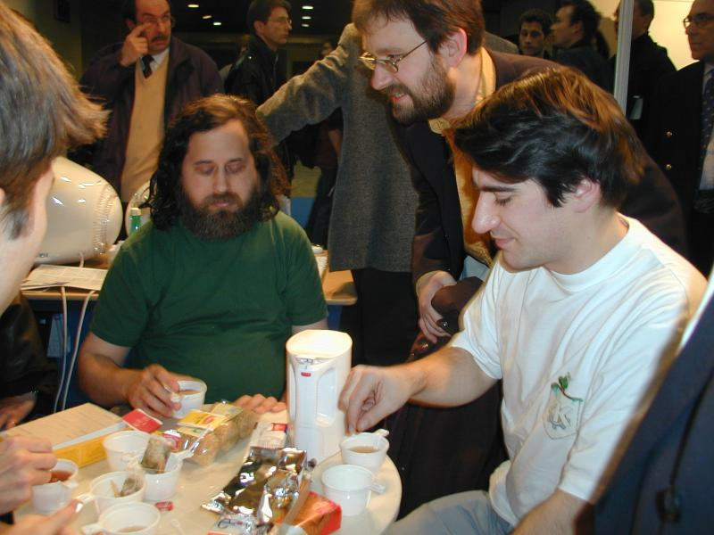

For Linux Solutions 2003 (see my [report](archives/Linux_Solutions_2003)) , the french KDE team thought
that we could take the oppurtunity to improve our relationship with RMS.
He seems to accepts KDE as fully free software now. So we invited him
for a tea, to show him the latest KDE and discuss. He accepted.

As promised, RMS came to visit us and see KDE after his conference. We
thought he would just had a quick look but it turns out that he stayed
for an hour! We had tea, we had biscuits, we had chairs, Knoppix with
KDE 3.1 and a laptop for demonstration.

One question I wanted to ask him for a long time is how often he runs X
. The answer was the one I had forcast: *sometimes*. Most of the time,
he is using emacs in terminal mode for more or less everything.

He asked me what I was doing and I talk about
_KVim_. He said something like: *I
can't tell if I am more sorry for vim or for KDE* . We then talked a bit
about emacs and if an embeddable version could be made for KDE, like for
the vimpart.

Gerard ask him if emacs was using gettext and could be translated. It
turns out emacs is not using gettext, which is a reason why it can not
be translated. There are incompatible API for this but someone can
tackle the problem.

He asked whether KDE people were saying "Gnu/Linux" or just "Linux", and
Open Source or Free Software. I told him some of us are using
KDE/Gnu/Linux which pleased him as an answer.

We told him quickly what was in KDE 3.1 and gave him a Knoppix with KDE
3.1 and OpenOffice, all in french. We thought he would then leave but he
was willing to see KDE running. So Sebastien started demonstrating him
Konqueror and other stuff. Sebastien was willing to make a quick
overview of everything but Richard quickly stopped him, asking him to go
very slowly, explaining each key he types and what exactly happens on
the screen.

He spotted a bookmark named Linux and asked immediately what was in it,
Linux or GNU software (*Should not that be GNU/Linux ?*). It turns out
it was just a list of bookmark related to Free Software (freshmeat,
linuxfr, dot.kde.org, ...).

While discussing, we discovered that he was not subscribed to the linux
kernel mailing list, he just receives cc: sometimes. He did not know
about Kernel Traffic so we showed him (with konqueror of course). He was
disappointed not to see his recent thread about Linux and GNU/Linux
mentionned. He receives something like 300 mails every day, and one
third of that is spam.

We showed him the konsole embedded into Konqueror. The first thing he
did was to run emacs in text mode, which was successful. So we had emacs
inside konsole inside konqueror. Fun!

After that, he took the mouse and start wandering throught the control
center. He checked a few things and seeemed to find it interesting. He
had problems with the french keyboard, so we enabled a dual
french/english keyboard.

Since he was mainly a terminal user, I showed him the multi-terminal
capability of konsole. This highlighted a bugs in emacs: it does not
notice that the konsole window is resized. I told him vim could do that
but he did not let the flamewar start :-) . I told him there is a kind
of signal emitted by the terminal when it resizes (I don't remember
exactly) and he wants me to send him more information on that.

He asked for a C binding that would be used equally with Gnome/Gtk or
KDE/Qt. I told him that this was more or less what WxWindows does, and
that apart from that, this is not a good idea. First, both toolkits,
although they have the same api, are internally very different. Second,
it would prevent people from using the real interesting features of KDE
or Gnome. He insisted quite a lot on that. This allow him to remind us
that KDE is C++ and C++ is still discouraged for Gnu Software. I asked
if C was still the recommended language. He just points out that the FSF
actually recommends C for programs that want to run fast but do not
object other programming languages.

After one hour, he had to leave to visit other booth. All in all, this
was a very nice and interesting meeting. He consider now KDE as a fully
free desktop and we even discussed the possibility of getting into the
Gnu project. He did not oppose the idea although many KDE hackers would
probably not accept.

*Bluebird*

