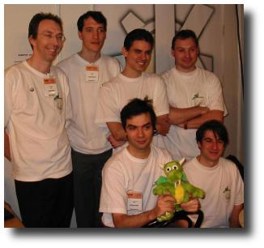

Like [Linux Expo 2002](archives/Linux_Expo_2002), a Linux Expo is held
in Paris. This year was again at the CNIT (La Defense). The name has
changed to Solutions Linux because Linux Expo has gone bankrupt (I was
told). Anyway, this is the same event, with the same spirit.

## Before the exhibition

The key to a successful exhibition is prepartion. KDE-France was quite
well prepared, thank to its active members. Many ideas have been
suggested to make the event more attractive and most of them have been
implemented.

We wanted to have projector but havn't managed to get one. So we just
had my 21'' monitor, which is still quite impressive. Next year, I ask
my colleague who owns a plasma screen if he can lend it to us.

Gerard suggested to invite RMS to have a drink. RMS seems to have soften
his position toward KDE and to be willing to recognise the project. He
has accepted and we have had him at the KDE booth for an hour. I made a
special report for that: [KDE has tea with RMS](archives/KDE_has_tea_with_RMS)

We wanted to have some goodies to sell, to make a little money for
KDE-France and to give the opportunity to people to buy something from
KDE. Thank to KernelConcepts and the KDE eV, we had 16 teddy-konqui (30
euro), 20 mouse pads (10 euro) and 100 pins (2 euros). We had almost no
margin on all this.

One week before the expo came the idea that it would be cool to give the
visitors something to try KDE. KDE 3.1 was just out, so Laurent Rathle
tackled the task of creating a special Knoppix, with KDE 3.1 in french
and OpenOffice in french. I am very impressed with the result as Laurent
is by no mean an expert in computer. Still he managed to customise a
full working distribution to its taste. To make KDE and OpenOffice fit
on one CD, we had to remove some stuff. It turned out Gnome was taking a
lot of place, so an easy decision was taken :-)

We also wanted to give some flyers away. Based on the work of last year,
I made a page presenting KDE, KOffice, Konqueror and KDevelop. I printed
300 of them. Gerard prepared a page presenting the KDE Edu project and
its software. And we made a page presenting the Rathlix (Laurent
Rathle's knoppix) and how to use it.

I also wanted to make a page explaining how to contribute to KDE
(translation, promotion, code, bug fixing, interviews, tutorial, ...)
but for various reason, I could not find the time for that.

I think we were quite ready. Gerard had some big drawers that he could
close with a key, so we had a safe area. We had good tea, cups, organic
sugar for our RMS tea.

Gerard advised to prepare a lot of Knoppix. He said we would sell more
than hundred CD per day. I was hoping to sell 30 of them but not really
more. Anyway, the day before the exhibition, we had one master CD which
Laurent finished a few hours ago and that's it. We managed to find two
CD writers on other boothes, we could have a few master CDs. Everyone
with a CD writer went home with a CD and spend the night writing Rathlix
CD.

## The exhibition

We had three huge posters for KDE, which the KDE-France team has managed
to print the previous year. The poster with the old fun splash screen
*KDE coming soon to your desktop* was still cool, so we displayed it.
Basically, we have covered all the walls with our stuff and it looks
like the whole booth was dedicated to KDE, while we were actually
sharing it with [OpenOffice.org](http://www.openoffice.org) and another
association. Nobody could miss us.

OpenOffice had two nice looking iMac running MacOs X with a beta of
OpenOffice. Apple had lent that to them, how kind! Hopefully, my 21 inch
was quite noticable too.

The night CD writing session was quite successful and we had something
like 40 Knoppix ready. I had printed 100 copies of the page presenting
the Knoppix. I thought that would be enough.

Many people came to the booth. All the one that were like *I don't know
exactly what Linux is, I am just here to discover* went away with our
special Knoppix (4 euro) to try at home. Many people came for technical
support (*you see if I use arts and blah blah blah, it doesn't work*)
and I redirected to mandrake website most of the time. I was glad to
hear that most people were running a Mandrake, as opposed to last year
were they were mostly running a Red Hat.

The Knoppix CD were selling very well. I had an appointment at noon.
When I came back at three o'clock, all of my knoppix sheets had been
given. This means we had sold more than 100 knoppix in the very first
day. Gerard was jubilating (*What did I told you, we are going to sell
more than 100 a day!*).

The OpenOffice guys were redirecting people to our booth, for those who
wanted to run a french version of OpenOffice on their computer.

In the second day, David and another guy said in their conference that
people could find a KDE demo CD in our booth. So we had another stream
of people coming to buy CDs. I think we sold more than 250 Knoppix in
the total. All these people will have opportunities to see KDE!

Many people came to congratulate the KDE project, and bought a pins or a
mouse pad just to support KDE. David has been demonstrating Kolab a few
times to interested visitors.

During the second day, there was a demonstration against EUCD. We went
through the exhibition shouting *Contre l'EUCD, pour le droit d'auteur!*
(Oppose EUCD, support copyright) and distributing some flyers. After
going through the whole exhibition, we gather in a big round and
somebody tied our wrists with a long rope. We then continue shouting for
5 or 10 minutes. I hope this has had an impact. At least, I heard people
asking what was the EUCD, so at least it had been informative.

We had less people on the third day, which was good because we were
getting tired. Did I forgot something ? Yes, the RMS meeting. I have
dedicated a special page for this tea party. So please go to the
[KDE has tea with RMS](archives/KDE_has_tea_with_RMS) for more.

I haven't spent time trough the commercial part of the exhibition. It
was mostly boring. Microsoft was there, advertising for their shared
source. Too bad I had not cream pie. I thought about going to Red Hat
and ask for a packaged version of latest KDE but I just gave up the
idea. Red Hat despise KDE for so long time now that I see no reason to
make an effort toward them. I had a quick wander through the other
booths. [Copine de geek](http://www.copinedegeek.com/) had a nice
all-pink booth and this is everything I remember from the non KDE booth.

I think the exhibition was a great success. I would like to congratulate
and thank:

-   The french KDE translation team: they do a wonderful job. They have
    created an association for supporting KDE related activites. They
    are the second team in term of translation completion

(application and documentation) - the first one being the swedish team.
They also translate the releases, the dot articles, some random
articles.

-   Loic Bernable, who organised the association part of the Linux Expo
-   Klaus Knopper for his [Knoppix](http://www.knoppix.net/). Lot of
    people will discover Linux and KDE.
-   Speka Networks: The CEO came to the exhibition with 3 CD writers and
    has created more than 60 Knoppix-KDE just for us. He would even
    bring them to our booth. The most surprising is that he does not
    even run KDE. The company is working in wireless security. He told
    me he tried to save the network (mostly down during the exhibition)
    by replacing the exhibition router by his. He also provided wifi
    coverage for the whole expo.

*by Bluebird*
