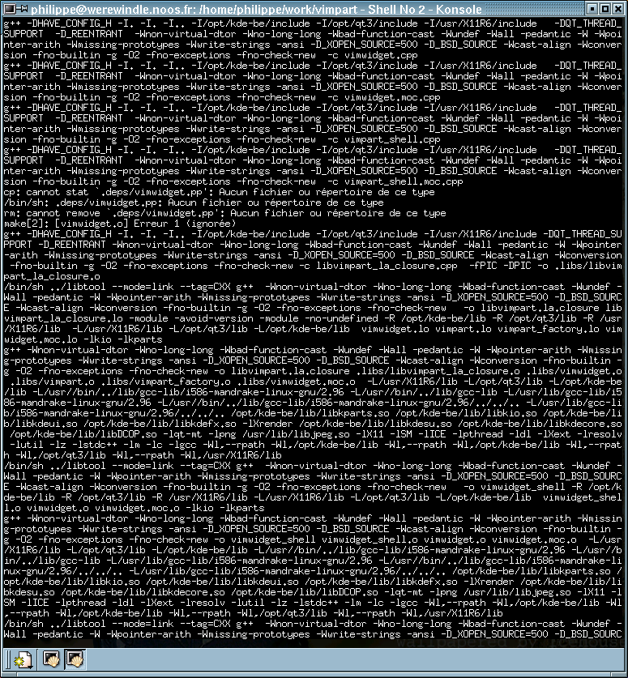
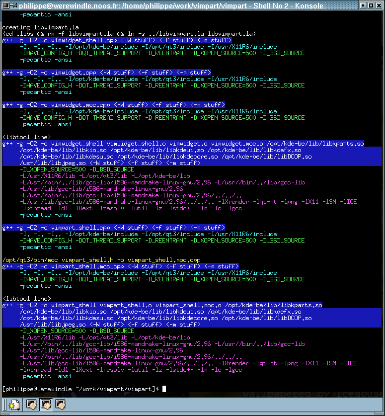

## Pretty-Make

*Pretty-Make is very very outdated. But it was useful when compiling a program for KDE2. This page is for historical purpose*

Pretty make is a very small python script that will organise and colorize your
make output. I have written this because when compiling, I was sick of the endless lines of
uninteresting options, which were hiding the gcc options I was looking
for.

The program analyses its specific options then runs make with all the other
options. So it is compatible with make. I use it every week to compile KDE
with alias `make="pretty_make.py"`. I use the escape codes to colorize the
output.

People have been wondering about CPU usage. Starting the python interpreter
takes a little CPU, but this is before you have started your
compilation, so you sill have plenty of CPU anyway.  The python interpreter is
started only once for a make command, so it won't matter much in you overall
compilation speed.

Now, the parsing of the
line uses builting python functions, which are written in C. So this is fast
and there is really not a lot of work: split the line, compare beginning of
words, fill lists, display. And such a line is displayed when gcc choose a new
file to compile, so the tiny amount of CPU taken would have probably not been
used anyway (except if you use -j12) because gcc was still loading the files
at that time. When I compile, python doesn't make into 'top', so it
effectively does not take CPU.

## Features
All features are of course configurable.

* Adapt the output to your terminal width
* Hide libtool lines: the next line is the real compile line anyway.
* Group similar options on separate lines: all -D together, all -I together, ...
* Can hide uninteresting option: you get &lt;-W&gt; instead of all
the -W options.
* Colorize options differently: makes it easier to distinguish between -L,
-I and -D
* Colorize moc and uic lines differently: else, you tend to miss them even when looking for them
* Enable or disable colors
* Post-process your compilation output: compile with output to a file and
beautify it later.
* Useable inside vim and probably other editors
* All options configurable

The default options you might want to alter are at the beginning of the
program. There is no need to know python to modify them.

## Screenshot

*Before*

*After*

## Release history

### 20/07/2003 - 1.3

* add more compiler names
* add a debug option
* handles properly argument with spaces inside
* can now compile kernel without problems

### 02/04/2002 - 1.2

* Argument -- passes all the remaining arguments to make (pretty-make.py --
--help yields make's help)
* Transparancy in konsole is preserved when not altering background color.
* Fix for arguments of type "arg=foo" that were not passed to make
* Fix for keyboard interruption (^C) would leave the make running wild in the
background

### 26/03/2002 - 1.1

* Fixes for tcsh users
* Improvements from Adrian Thurston

###	17/03/2002 - 1.0

Initial release

## Installation

* in your shell: `alias make=pretty_make.py`
* in vim (notice the backslash in front of --no-colors): `set makeprg=$HOME/python/pretty_make/pretty_make.py\ --no-colors`
* in compilations: `export MAKE=pretty_make.py`
* with configure: `MAKE=pretty_make.py ./configure`
* everywhere: it works also if you symlink to it as a make executable
(i.e `ln -s python/pretty-make/pretty_make.py bin/make`) but you must
edit pretty_make.py to have the MAKEPROG pointing to the real make program,
else you have recursive calls.
* In emacs: I don't know, but it is certainly possible.

